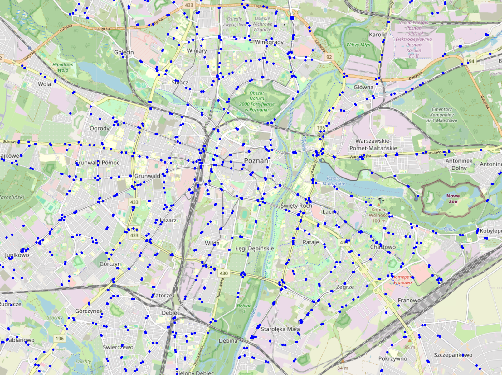
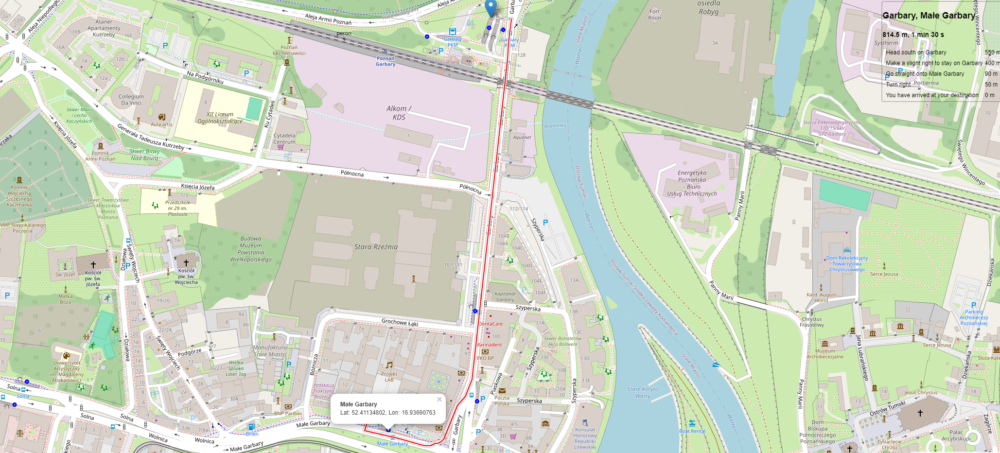

# **LogicWay - Hybrid Route Builder**

LogicWay is an open-source project aimed at building optimized hybrid routes for urban navigation. It incorporates a custom algorithm that considers both walking speed and various transportation modes to create efficient, personalized routes. This project is built using **Django** for the backend, with **HTML**, **JavaScript**, and **PostgreSQL** for database.

## **Key Features**
- **Hybrid Route Calculation**: Combines walking and public transit to provide the most efficient path.
- **Speed-Aware Algorithm**: Tailors routes to the user's walking speed, improving travel time accuracy.
- **Dynamic Routing**: Continuously adapts to real-time changes, such as traffic and transit schedules.
- **Gated Open-Source**: Available for anyone to use, modify, and contribute.

## **Technologies Used**
- **Backend**: Powered by Django Framework (Python 3.x)
- **Frontend**: HTML, JavaScript, OpenStreetMap
- **Database**: PostgreSQL
- **APIs**: OpenStreetMap API and Valhalla (by routingpy), Nominatim (by geopy).
 

  
